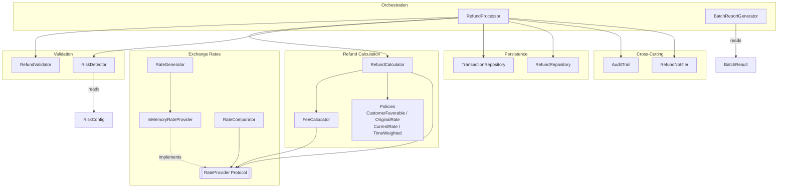
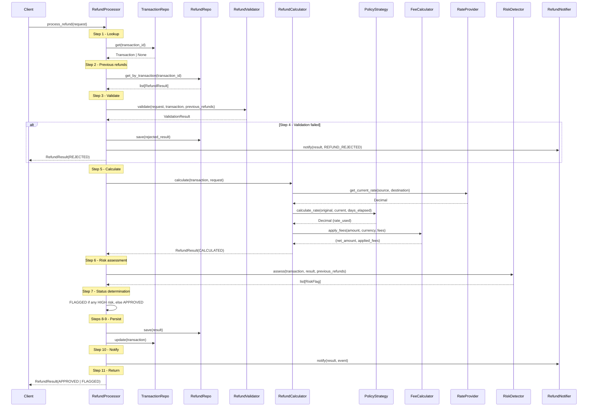
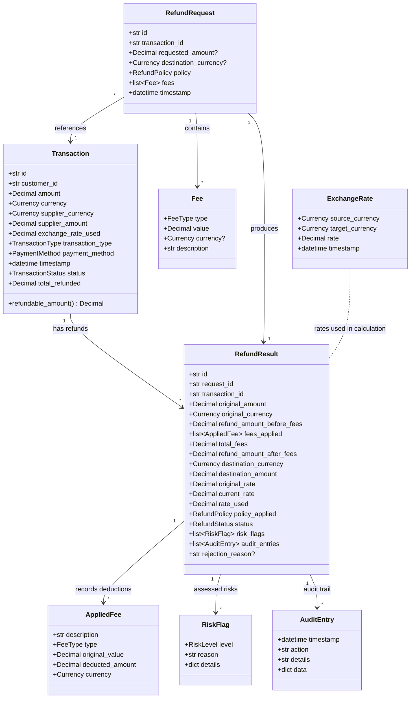

# Multi-Currency Refund Engine -- Design Document

## 1. Architecture Overview

The engine is organized into six modules, each with a single responsibility. `RefundProcessor` acts as the orchestrator, delegating to specialized components for validation, calculation, risk assessment, persistence, and notification.

All inter-module communication happens through Pydantic models defined in `src/models.py`. External dependencies (exchange rate APIs, databases) are abstracted behind protocols so the core logic remains testable and swappable.



**Key architectural properties:**

- **No circular dependencies.** Data flows top-down from processor to calculation to exchange/persistence layers.
- **Protocol-based boundaries.** `RateProvider` is a `typing.Protocol`, not an ABC. Any object with the right method signatures satisfies it -- no inheritance required.
- **Pydantic everywhere.** All domain objects use Pydantic `BaseModel` with field validators, giving automatic validation, serialization, and immutability via `model_copy`.

---

## 2. Processing Pipeline

`RefundProcessor.process_refund()` executes an 11-step pipeline. Steps 1-4 are pre-checks; steps 5-7 are core computation; steps 8-11 are persistence and notification.

| Step | Component | Action |
|------|-----------|--------|
| 1 | `TransactionRepository` | Look up transaction by ID |
| 2 | `RefundRepository` | Fetch previous refunds for this transaction |
| 3 | `RefundValidator` | Validate: transaction exists, status eligible, amount valid, no duplicates |
| 4 | `RefundProcessor` | If invalid, build REJECTED result, save, notify, return early |
| 5 | `RefundCalculator` | Calculate refund: determine amount, resolve rates, apply policy, apply fees, convert currency |
| 6 | `RiskDetector` | Assess risk: rate drift, large amount, multiple refunds, old transaction |
| 7 | `RefundProcessor` | Determine status: FLAGGED if any HIGH risk flag, APPROVED otherwise |
| 8 | `RefundRepository` | Persist the `RefundResult` |
| 9 | `TransactionRepository` | Update transaction `total_refunded` and status (PARTIALLY_REFUNDED or REFUNDED) |
| 10 | `RefundNotifier` | Send notification (REFUND_APPROVED or REFUND_FLAGGED) |
| 11 | `RefundProcessor` | Merge calculator audit entries with processor audit entries, return result |



---

## 3. Key Design Decisions

### Strategy Pattern for Refund Policies

**Why:** The Open/Closed principle -- adding a new exchange rate policy requires only a new class and a `_POLICY_MAP` entry. The calculator never changes.

Four strategies implement `RefundPolicyStrategy`:

| Strategy | `calculate_rate(original, current, days_elapsed)` | Use case |
|---|---|---|
| `CustomerFavorablePolicy` | `max(original, current)` | Customer goodwill; always pick the rate that yields more destination currency |
| `OriginalRatePolicy` | `original` | Default; honor the rate at booking time |
| `CurrentRatePolicy` | `current` | Real-time market; shifts FX risk to the customer |
| `TimeWeightedPolicy` | `original * (1 - w) + current * w` where `w = min(days/90, 1.0)` | Gradual blend; recent cancellations favor original rate, older ones converge to market |

`RefundPolicyStrategy` is itself a `Protocol`, not an ABC. Strategies need no base class -- they just need `calculate_rate()` and a `name` property.

### Protocol-based Abstractions

`RateProvider` is defined as:

```python
class RateProvider(Protocol):
    def get_rate(self, source: Currency, target: Currency, date: datetime) -> Decimal: ...
    def get_current_rate(self, source: Currency, target: Currency) -> Decimal: ...
    def get_rate_at_date(self, source: Currency, target: Currency, date: datetime) -> ExchangeRate: ...
```

**Why Protocol over ABC:**

- Duck typing -- any object with matching signatures works, no inheritance needed.
- `InMemoryRateProvider` is the concrete implementation for testing and demos.
- Swapping to a real API provider (e.g., wrapping an HTTP client) requires zero changes to `RefundCalculator` or `FeeCalculator`.

### Decimal Precision

- All monetary amounts and exchange rates use `Decimal` -- never `float`.
- `RateGenerator` stores rates as strings in JSON (`"rate": str(r.rate)`), parsed back to `Decimal` on load. This avoids IEEE 754 floating-point drift during serialization.
- Final amounts are quantized to 2 decimal places: `.quantize(Decimal("0.01"))`.
- Exchange rates are quantized to 6 decimal places: `.quantize(Decimal("0.000001"))`.

### Fee Application Order

```
1. Percentage fees (compound on remaining balance)
2. Fixed fees (converted to refund currency if needed)
3. Net amount floored at zero
```

**Rationale:** Percentage fees are proportional to the refund amount, so applying them first on the full balance is fairer. Fixed fees are absolute charges that don't scale with amount. If a fixed fee is denominated in a different currency than the refund, `FeeCalculator` converts it using the current rate via `RateProvider`. The floor at zero prevents negative refund amounts.

Each percentage fee compounds on the remaining balance after prior percentage fees, not on the original amount.

### Audit Trail Design

- Every processing step generates an `AuditEntry` with `action`, `details` (human-readable), and `data` (structured dict).
- `RefundCalculator.calculate()` produces 7 audit entries (amount determination, destination currency, rate lookup, policy applied, fee application, conversion, final calculation).
- `RefundProcessor.process_refund()` adds 5+ entries (transaction lookup, previous refunds lookup, validation, calculation summary, risk assessment, status determination, transaction update).
- Entries from both sources are merged into the final `RefundResult.audit_entries` list.
- `AuditTrail.format_report()` generates a timestamped, human-readable log for debugging:
  ```
  [2026-02-25 14:30:00] rate_lookup: Original rate: 0.92, Current rate: 0.94 | original_rate=0.92, current_rate=0.94
  ```

### Risk Assessment

`RiskDetector.assess()` runs 4 independent checks, each producing a `RiskFlag` with a `RiskLevel`:

| Check | Condition | Level |
|---|---|---|
| Exchange rate drift | `abs(current - original) / original > threshold` | MEDIUM if `> threshold`, HIGH if `> threshold * 2` |
| Large refund | USD equivalent `> large_refund_threshold_usd` | MEDIUM if `> threshold`, HIGH if `> threshold * 2` |
| Multiple refunds | Active (COMPLETED/PROCESSING) refunds `>= 2` on same transaction | MEDIUM normally, HIGH if `>= max_refunds_per_transaction` |
| Old transaction | `days_old > old_transaction_days` | LOW always |

**Status escalation:** If any flag has `RiskLevel.HIGH`, the refund status is set to `FLAGGED` (manual review needed). Otherwise it is `APPROVED`.

All thresholds are configurable via `RiskConfig`:

```python
class RiskConfig(BaseModel):
    exchange_rate_drift_threshold: Decimal = Decimal("0.10")   # 10%
    large_refund_threshold_usd: Decimal = Decimal("2000")
    max_refunds_per_transaction: int = 3
    old_transaction_days: int = 30
```

USD conversion for the large-refund check uses static approximate factors (e.g., `EUR -> * 1.09`, `BRL -> / 5.2`), not live rates. This is intentional -- risk thresholds don't need market-precision conversion.

### Repository Pattern

- `TransactionRepository` and `RefundRepository` use in-memory `dict[str, Model]` storage.
- Both provide `save`, `get`, `get_all`, `update` methods. `RefundRepository` adds `get_by_transaction()` for looking up refund history.
- `update()` raises `KeyError` if the entity doesn't exist -- fail-fast over silent creation.
- Replacing with database-backed storage requires implementing the same method signatures. No interface or protocol is formally declared; the pattern is implicit.

---

## 4. Data Model



---

## 5. Complexity Analysis

### Time Complexity

| Operation | Complexity | Explanation |
|---|---|---|
| Single refund | O(F + R) | F = number of fees to apply, R = number of previous refunds for validation and risk checks |
| Rate lookup (exact) | O(1) | Dict keyed by `(source, target, date_str)` |
| Rate lookup (nearest date) | O(14) | Scans +/-7 days with 2 directions per offset = constant |
| Cross-rate derivation | O(C) | Scans `_all_rates` list for source->USD and USD->target; C = number of currencies = 6 |
| `get_current_rate` | O(N) | Linear scan of `_all_rates` to find most recent matching pair; N = total stored rates |
| Batch processing | O(B * (F + R)) | B = batch size; each request runs the full pipeline |
| Rate generation | O(D * C^2) | D = days, C = currencies; generates all permutation pairs per day |

### Space Complexity

| Structure | Complexity | Typical size |
|---|---|---|
| Exchange rates | O(D * C^2) | 90 days * 6 * 5 = 2,700 `ExchangeRate` objects + dict entries |
| Rate dict | O(D * C^2) | Same 2,700 entries keyed by `(Currency, Currency, str)` |
| Transactions | O(T) | T = number of stored transactions |
| Refunds | O(N) | N = number of stored refund results |
| Audit entries per refund | O(1) | ~12 entries per refund (7 from calculator + 5 from processor) |
| Risk flags per refund | O(1) | At most 4 flags (one per check) |

---

## 6. Extension Points

| Extension | How to implement | Files to change |
|---|---|---|
| New refund policy | Create a class with `calculate_rate(original, current, days_elapsed) -> Decimal` and a `name` property. Add it to `_POLICY_MAP` in `policies.py`. Add the enum value to `RefundPolicy`. | `src/enums.py`, `src/refund/policies.py` |
| New currency | Add value to `Currency` enum. Add base rate entry in `RateGenerator.BASE_RATES`. Add USD conversion factor in `RiskDetector._USD_CONVERSION`. Add symbol in `BatchReportGenerator._CURRENCY_SYMBOLS`. | `src/enums.py`, `src/exchange/rate_generator.py`, `src/validation/risk_detector.py`, `src/batch/batch_processor.py` |
| Real rate provider | Implement a class with `get_rate()`, `get_current_rate()`, and `get_rate_at_date()` methods matching the `RateProvider` protocol. Inject it into `RefundProcessor` constructor. | New file only; no changes to existing code |
| Database storage | Implement classes with the same method signatures as `TransactionRepository` and `RefundRepository` (save, get, get_all, update, get_by_transaction). Inject into `RefundProcessor`. | New file only; no changes to existing code |
| New risk check | Add a private method `_check_<name>()` to `RiskDetector` that appends `RiskFlag` instances. Call it from `assess()`. Optionally add config fields to `RiskConfig`. | `src/validation/risk_detector.py`, `src/models.py` (for config) |
| New fee type | Add value to `FeeType` enum. Add handling branch in `FeeCalculator.apply_fees()` alongside the existing percentage/fixed logic. | `src/enums.py`, `src/refund/fee_calculator.py` |
| New notification channel | Extend `RefundNotifier` or create an alternative implementation. The processor calls `notify(result, event)` -- any object with that signature works. | `src/notifications/notifier.py` or new file |
