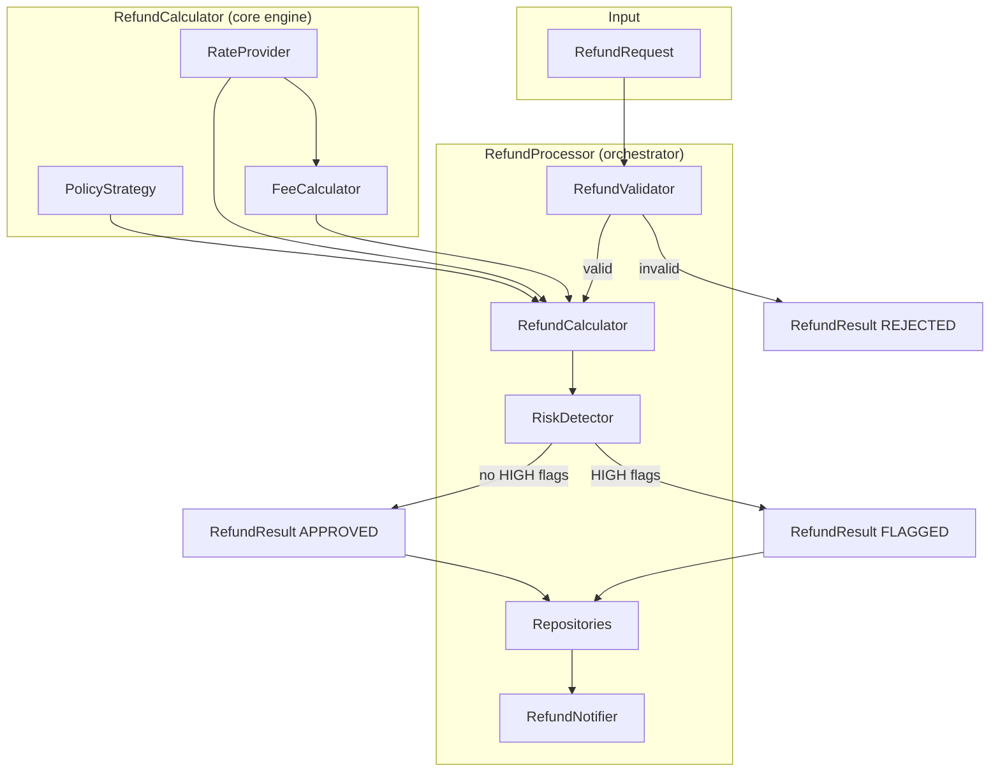
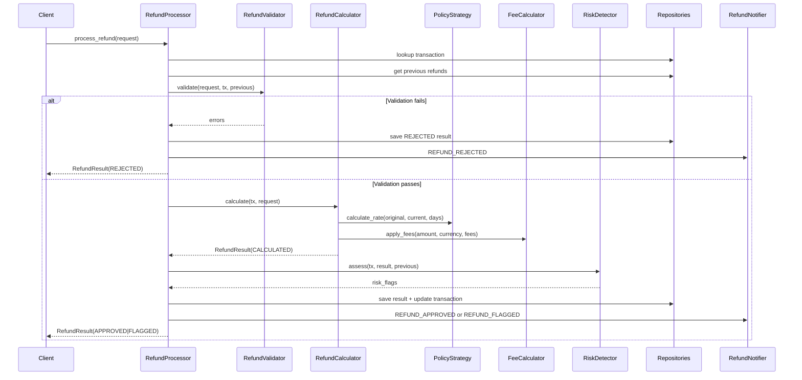

# Multi-Currency Refund Engine

## Problem Summary

When a travel platform operates across multiple currencies, refunding a customer is never as simple as reversing a charge. A flight booked in BRL but settled with a supplier in USD involves an exchange rate that may have shifted by the time the customer requests a refund days or weeks later. The platform must decide which rate to use, whether to absorb the drift or pass it on, and how to apply cancellation fees that may themselves be denominated in a different currency.

This engine solves the multi-currency refund problem for a travel payment platform. It calculates refund amounts across six currencies (USD, EUR, BRL, MXN, COP, THB), applies configurable refund policies that determine which exchange rate to use, deducts percentage and fixed fees with cross-currency conversion, and flags high-risk refunds for manual review. Every step produces an auditable trail.

The system handles full and partial refunds, prevents duplicate and excessive refund attempts, tracks cumulative refunds per transaction, and supports batch processing with aggregated reports. It is designed as a self-contained proof of concept with no external dependencies beyond Pydantic.

## Quick Start

```bash
# Install dependencies
pip3 install pydantic pytest pytest-cov

# Run the 12-scenario demo
python3 demo.py

# Run the test suite
python3 -m pytest tests/ -v

# Run with coverage
python3 -m pytest tests/ --cov=src --cov-report=term-missing
```

## Architecture Overview



### Processing Pipeline



## Refund Policies

The engine supports four exchange rate selection strategies, implemented via the Strategy pattern:

| Policy | Rate Used | When to Use | Example |
|--------|-----------|-------------|---------|
| **ORIGINAL_RATE** | Rate at booking time | Default. Fair when rates are stable. | BRL/USD was 0.19 at booking, still uses 0.19. |
| **CURRENT_RATE** | Latest available rate | When the platform wants to reflect market reality. | BRL/USD moved to 0.20; refund uses 0.20. |
| **CUSTOMER_FAVORABLE** | `max(original, current)` | Customer-first policy. Always gives the customer more. | Original 0.19 vs current 0.20: uses 0.20. |
| **TIME_WEIGHTED** | Blend of original and current based on elapsed days | Compromise for older transactions. Recent refunds lean toward original rate; older ones toward current. | 75 days elapsed (90-day window): `weight = 75/90 = 0.83`, so rate = `0.17 * original + 0.83 * current`. |

### Time-Weighted Formula

```
weight = min(days_elapsed / 90, 1.0)
rate   = original_rate * (1 - weight) + current_rate * weight
```

A refund requested the same day uses the original rate. A refund at 90+ days uses the current rate entirely.

## Validation Rules

The `RefundValidator` checks every request before calculation:

| Code | Rule | Rejection Condition |
|------|------|---------------------|
| `TRANSACTION_NOT_FOUND` | Transaction must exist | Transaction ID not in repository |
| `TRANSACTION_NOT_ELIGIBLE` | Transaction status must be `SUCCESS` or `PARTIALLY_REFUNDED` | Status is `REFUNDED` or `FAILED` |
| `AMOUNT_EXCEEDS_REMAINING` | Requested amount must not exceed refundable balance | `requested_amount > tx.amount - tx.total_refunded` |
| `INVALID_AMOUNT` | Requested amount must not be zero | `requested_amount == 0` |
| `NOTHING_TO_REFUND` | Full refund requests require remaining balance | `refundable_amount <= 0` and no explicit amount |
| `DUPLICATE_REFUND` | Same transaction + same amount must not already be `COMPLETED` or `PROCESSING` | Matching active refund found |

## Risk Assessment

The `RiskDetector` evaluates four checks after calculation. Any `HIGH`-level flag changes the result status from `APPROVED` to `FLAGGED`:

| Check | Condition | Level | Threshold |
|-------|-----------|-------|-----------|
| **Exchange rate drift** | Rate changed significantly since booking | `MEDIUM` if drift > threshold; `HIGH` if drift > 2x threshold | Default: 10% (configurable) |
| **Large refund amount** | USD-equivalent exceeds threshold | `MEDIUM` if > threshold; `HIGH` if > 2x threshold | Default: $2,000 USD (configurable) |
| **Multiple refunds** | Transaction has 2+ active previous refunds | `MEDIUM` if < max; `HIGH` if >= max | Default: max 3 per transaction |
| **Old transaction** | Transaction age exceeds limit | `LOW` | Default: 30 days |

All thresholds are configurable via the `RiskConfig` model.

## Fee Handling

Fees are applied **before** currency conversion, in the customer's original currency. This ensures transparency: the customer sees exactly what was deducted before the exchange.

### Application Order

1. **Percentage fees first** -- each applied against the remaining balance after prior percentage fees
2. **Fixed fees second** -- converted to the refund currency if denominated in a different currency

### Cross-Currency Fee Conversion

When a fixed fee is specified in a different currency (e.g., a $25 USD processing fee on an MXN refund), the `FeeCalculator` converts it using the current exchange rate from the `RateProvider`.

### Example

```
Original amount:  MX$8,500 MXN
15% cancellation: MX$8,500 * 0.15 = MX$1,275 deducted  ->  MX$7,225 remaining
$25 USD fixed:    $25 * 19.50 (USD->MXN rate) = MX$487.50 deducted  ->  MX$6,737.50 remaining
Convert to USD:   MX$6,737.50 * 0.0513 (MXN->USD rate) = $345.55 USD
```

The net amount is floored at zero -- fees can never produce a negative refund.

## Test Data

The `data/` directory contains pre-generated datasets:

| File | Contents | Count |
|------|----------|-------|
| `exchange_rates.json` | Daily rates for all 30 currency pairs | 2,700 entries (90 days x 30 pairs) |
| `transactions.json` | Transactions across 6 currencies, 3 types, 3 payment methods | 50 |
| `refund_requests.json` | Requests covering all policies, fee types, edge cases | 20 |

### Regenerate Test Data

```bash
python3 data/generate_test_data.py
```

Exchange rates use synthetic generation with daily volatility (0.3%) and mean reversion toward base rates, producing realistic price paths without requiring an external API.

## Testing

**130 tests | 97% coverage**

```bash
# Full suite with verbose output
python3 -m pytest tests/ -v

# With coverage report
python3 -m pytest tests/ --cov=src --cov-report=term-missing
```

### Test Breakdown

| Module | Test File | Focus |
|--------|-----------|-------|
| `test_exchange/` | `test_rate_provider.py` | Rate lookup, cross-rate derivation, closest-date fallback |
| | `test_rate_comparator.py` | Drift calculation, significance checks |
| | `test_rate_generator.py` | Synthetic rate generation, deterministic seeding |
| `test_refund/` | `test_policies.py` | All 4 strategy implementations, edge cases |
| | `test_fee_calculator.py` | Percentage, fixed, mixed fees, cross-currency conversion |
| | `test_calculator.py` | Full calculation pipeline, same/cross currency |
| | `test_processor.py` | Orchestration, rejection paths, status updates |
| `test_validation/` | `test_validator.py` | All 6 validation rules |
| | `test_risk_detector.py` | All 4 risk checks, threshold behavior |
| `test_audit/` | `test_audit_trail.py` | Entry recording, serialization, reporting |
| `test_batch/` | `test_batch_processor.py` | Batch aggregation, per-currency totals |
| `test_integration/` | `test_end_to_end.py` | Full pipeline from request to result |

## Design Decisions & Trade-offs

### Strategy Pattern for Policies (Open/Closed Principle)
Each refund policy is an independent class implementing the `RefundPolicyStrategy` protocol. Adding a new policy (e.g., `MEDIAN_RATE`) requires creating one class and adding it to the policy map -- no existing code changes needed.

### In-Memory Storage (Simplicity over Persistence)
Repositories use Python dicts. This keeps the engine self-contained and testable without database setup. A production system would swap in database-backed implementations behind the same interface.

### Decimal over Float for Monetary Precision
All monetary amounts use `Decimal` with explicit quantization (`0.01` for amounts, `0.000001` for rates). This eliminates floating-point rounding errors that would be unacceptable in financial calculations.

### Fees Applied Before Conversion (Transparency)
Fees are deducted in the customer's original currency before converting to the destination currency. This lets the customer see exactly how much was deducted in their own currency, rather than having fees and conversion tangled together.

### Synthetic Rates with Mean Reversion (Realistic without External API)
The `RateGenerator` produces 90-day rate histories using Gaussian noise with mean reversion toward base rates. This creates realistic exchange rate paths (gradual drift, no extreme jumps) without requiring API keys or network access.

### Customer-Favorable = max(original, current)
The `CUSTOMER_FAVORABLE` policy always picks the rate that gives the customer more money in the destination currency. This is the safest choice for customer retention.

### Time-Weighted Blends over 90-Day Window
The `TIME_WEIGHTED` policy linearly interpolates between original and current rates based on days elapsed (capped at 90). This provides a fair compromise: recent cancellations get close to the original rate, while older ones gradually shift toward the current market rate.

## Stretch Goals Implemented

- **Batch Processing** -- `RefundProcessor.process_batch()` processes multiple requests and returns a `BatchResult` with per-currency totals, approval/flagged/rejected counts, and a formatted summary report via `BatchReportGenerator`.

- **Webhook Notification Simulation** -- `RefundNotifier` dispatches structured notifications for key refund events (`REFUND_CALCULATED`, `REFUND_APPROVED`, `REFUND_FLAGGED`, `REFUND_REJECTED`), stored in memory for inspection.

- **Configurable Risk Thresholds** -- `RiskConfig` allows tuning the large refund threshold, exchange rate drift threshold, max refunds per transaction, and old transaction age -- all passed to `RiskDetector` at construction time.
